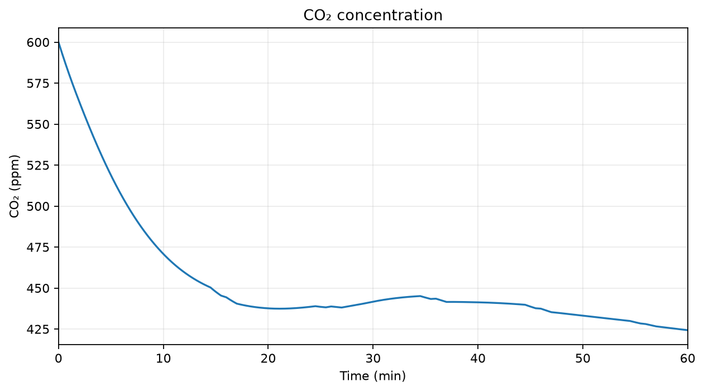

# Metro Station Mathematical Modeling

[](remodeled-model/pyproject.toml)
[](LICENSE)
[](https://github.com/uzoom333/metro-station-mathematical-modeling/commits/main)
[](https://github.com/uzoom333/metro-station-mathematical-modeling/actions/workflows/v2-ci.yml)

## Recognition

🏆 **4th Place — Mathematical Modeling Challenge**

**X Congress of Science, Technology and Innovation**

**Pontifical Catholic University of Goiás (PUC Goiás)**

**2024**

This repository documents two complementary stages of an undergraduate
mathematical modeling project: the reasoning developed for the original 2024
competition and a later computational redevelopment created with Python and
scientific-computing tools.

The original project studied ventilation and thermal conditions in one
hypothetical metro station. It connected passenger and train heat, airflow, air
renewal, station volume, temperature, pressure-related reasoning, and multiple
differential equations. The competition emphasized assumptions, logical
decomposition, and mathematical reasoning rather than a construction-ready
engineering design.

## Table of Contents

- [Project Evolution](#project-evolution)
- [Repository Structure](#repository-structure)
- [Which Version Should I Explore?](#which-version-should-i-explore)
- [Version 2 Preview](#version-2-preview)
- [Project Timeline](#project-timeline)
- [Why I Revisited This Project](#why-i-revisited-this-project)
- [Academic and Engineering Scope](#academic-and-engineering-scope)
- [License](#license)

## Project Evolution

| Version | Description |
|---|---|
| [Version 1](original-model/) | Faithful reconstruction of the original mathematical reasoning using recreated values |
| [Version 2](remodeled-model/) | Modern computational redevelopment using Python and scientific computing |

The fourth-place award belongs to the original 2024 project. Version 2 was
developed later as a continuation and expansion of its ideas.

## Repository Structure

```text
metro-station-mathematical-modeling/
├── original-model/    → faithful reconstruction of the original project
└── remodeled-model/   → modern computational redevelopment
```

The repository keeps the historical reconstruction and the later software
work side by side so that their relationship—and their differences—remain
clear.

## Which Version Should I Explore?

### Version 1 — Original Mathematical Model

Version 1 is the best place to understand the competition problem and its
original academic reasoning. It preserves:

- the problem statement;
- mathematical reasoning;
- engineering assumptions;
- variables;
- modeling methodology; and
- logical decomposition.

Numerical values, example parameters, station dimensions, Python code, and
documentation were recreated for the repository.

**→ [Explore Version 1](original-model/)**

### Version 2 — Computational Redevelopment

Version 2 is the best place to explore the project as reproducible scientific
software. It expands the original ideas with:

- a coupled differential-equation model;
- an installable Python package;
- scientific computing with NumPy, SciPy, pandas, and Matplotlib;
- numerical simulation;
- analytical and automated validation;
- operating and failure scenarios;
- sensitivity analysis;
- an illustrative optimization experiment;
- technical documentation;
- an executed notebook; and
- reproducible generated results.

**→ [Explore Version 2](remodeled-model/)**<br>
**→ [Technical Documentation](remodeled-model/docs/)**<br>
**→ [Executed Notebook](remodeled-model/notebooks/01_baseline_analysis.ipynb)**<br>
**→ [Generated Results](remodeled-model/results/)**

## Version 2 Preview

Every figure below was generated by the Version 2 code from synthetic,
illustrative inputs. They are model outputs, not measurements.

### Air and Structural Temperature


### Carbon-Dioxide Concentration

CO₂ is modeled as a ventilation-related state variable, not as a complete
measure of indoor air quality.



### Scenario Comparison


### Optimization Experiment


## Project Timeline

```text
2024
├── Mathematical Modeling Challenge
└── Fourth Place
          ↓
2026
├── Undergraduate Research
├── Linear Algebra
└── Scientific Computing
          ↓
Version 2
├── Computational redevelopment
├── Python and numerical simulation
└── Sensitivity analysis and optimization
```

## Why I Revisited This Project

Over the last months, I have been studying Linear Algebra through my
undergraduate research under Professor Marco Antônio Menezes, while using
Professor Gilbert Strang's work as one of my main references. During my
academic break, I decided to revisit this project.

I did not want simply to reproduce the competition submission. I wanted to
take the original idea further and transform it into a larger computational
project—one that would let me deepen the mathematics, learn scientific
computing, and begin working seriously with data-science tools.

My goal is to build a strong foundation in mathematics, scientific computing,
and data science before eventually specializing in AI Engineering. Academic
references remain central to that process, and I also use AI as a learning
tool for discussion, verification, and experimentation.

The original project taught me that mathematical modeling is not mainly about
arriving at one final numerical answer. It is about understanding a problem,
choosing useful assumptions, connecting variables, and translating logical
reasoning into mathematics. This repository documents that continuing learning
journey—from the original competition model to a tested and reproducible
computational redevelopment.

Suggestions, discussions, corrections, and improvements are welcome,
especially from students, educators, and researchers interested in
mathematical modeling and scientific computing.

## Academic and Engineering Scope

Version 1 faithfully reconstructs the original reasoning while using recreated
values. All Version 2 equations, architecture, parameters, simulations, graphs,
scenarios, sensitivity studies, optimization experiments, and conclusions were
developed after the competition using synthetic, illustrative data.

Neither version is a validated engineering design. The repository must not be
used to size or assess real ventilation, HVAC, railway, smoke-control, or
fire-safety systems. Analysis thresholds are experiment targets rather than
regulatory limits.

## License

This repository is available under the [MIT License](LICENSE).
