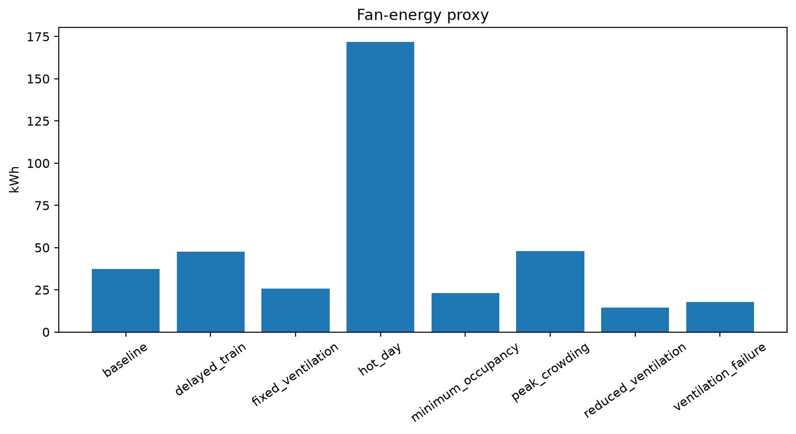

# Metro Station Mathematical Modeling

## Recognition

**4th Place — Mathematical Modeling Challenge** 
**X Congress of Science, Technology and Innovation** 
**PUC Goiás, 2024**

The original undergraduate project modeled ventilation and thermal conditions
in one hypothetical metro station using Differential Equations and Calculus II.
It considered minimum occupancy, passenger and train heat, airflow, air
renewal, station volume, temperature, pressure-related reasoning, and coupled
equations. The competition emphasized assumptions, logical reasoning, and
mathematical decomposition rather than a construction-ready design.

## Project Evolution

| Version | Purpose | Status |
|---|---|---|
| [V1](original-model/) | Faithful reconstruction of the original reasoning with recreated data | Available |
| [V2](remodeled-model/) | Newly developed coupled computational simulation | In review |

V1 preserves the original problem, methodology, major variables, engineering
assumptions, and mathematical approach. Numerical values, dimensions,
implementation, and documentation were recreated where historical material was
unavailable.

V2 was developed after the competition. Its equations, Python architecture,
synthetic parameters, scenarios, simulations, graphs, sensitivity analysis,
optimization experiment, and conclusions are new work. The fourth-place award
applies to the original 2024 project, not to V2.

## Version 2 Results

V2 couples air mass, air internal energy, structural temperature, internal
pressure, CO₂, ventilation actuator dynamics, trains, occupancy, and leakage.
All outputs below were calculated from synthetic illustrative inputs.

- [Version 2 technical documentation](remodeled-model/README.md)
- [Calculated results](remodeled-model/docs/08_results.md)
- [Executed baseline notebook](remodeled-model/notebooks/01_baseline_analysis.ipynb)

## Academic and Engineering Scope

All station dimensions and parameters in the repository are synthetic and
illustrative. The models are educational and are not validated engineering
designs. They must not be used to size or assess real ventilation, HVAC,
railway, smoke-control, or fire-safety systems. Analysis thresholds are
experiment targets rather than regulatory limits, and CO₂ is not a complete
measure of indoor air quality.

Licensed under the [MIT License](LICENSE).
