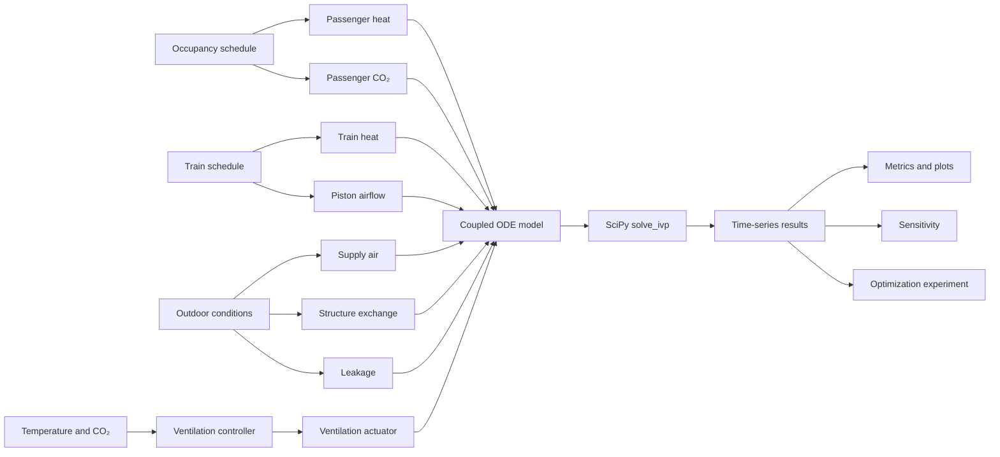
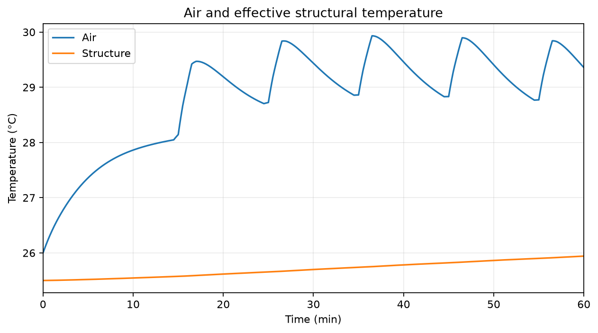
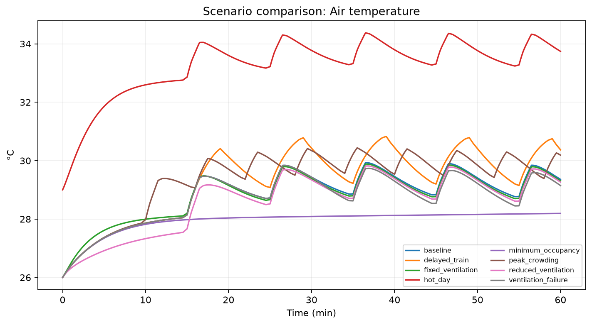
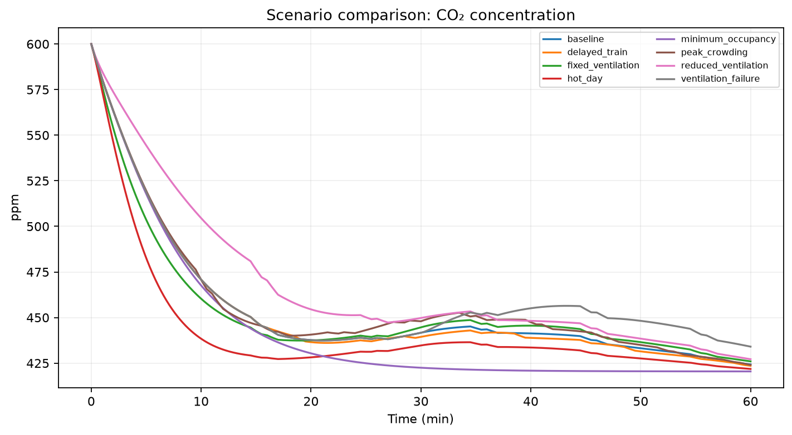
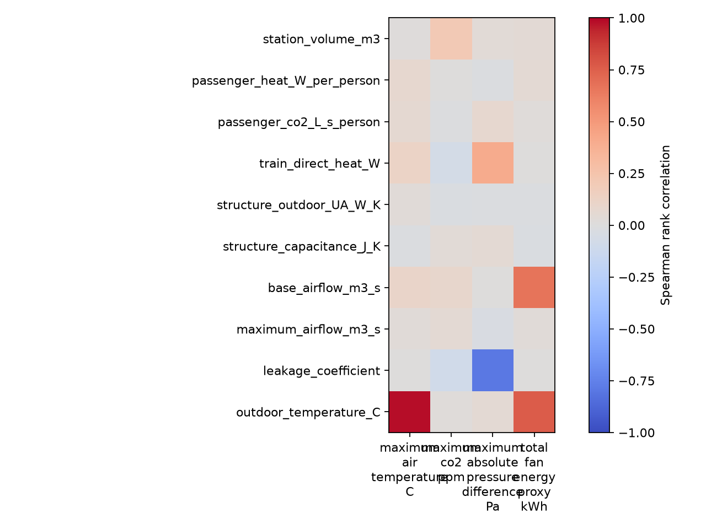

# Version 2 — Coupled Metro-Station Simulation

Version 2 is a modern computational redevelopment of the mathematical modeling
project that received fourth place at the Mathematical Modeling Challenge,
X Congress of Science, Technology and Innovation, PUC Goiás (2024). The
original problem, reasoning, major variables, and modeling methodology come
from that project. Every V2 equation, software component, numerical value,
simulation, graph, scenario, and conclusion was developed after the
competition using synthetic illustrative data. The award does not apply to V2.

## Motivation and Project at a Glance

V2 turns the original logical decomposition into a reproducible low-order
dynamic simulation for one hypothetical station.

| Item | V2 implementation |
|---|---|
| States | air mass, air internal energy, structural temperature, CO₂ moles, mechanical airflow |
| Derived states | air temperature, density, pressure, CO₂ ppm |
| Inputs | occupancy, trains, outdoor conditions, equipment |
| Air exchange | mechanical, train-piston, pressure-driven leakage |
| Control | fixed or demand-controlled ventilation with actuator lag |
| Solver | SciPy `solve_ivp`, RK45, deterministic 5 s output |
| Data | synthetic and illustrative |

CO₂ is a ventilation-related state variable here, not a complete measure of
indoor air quality.

## Physical subsystems and architecture



See [architecture.md](docs/architecture.md) for module responsibilities.

## State vector and central equations

\[
\mathbf y=[m_{air},U_{air},T_{structure},n_{CO_2},Q_{ventilation}]
\]

\[
T_{air}=\frac{U_{air}}{m_{air}c_v},\qquad
P_{air}=\frac{m_{air}R_{air}T_{air}}{V}
\]

\[
\frac{dm}{dt}=\dot m_{in}-\dot m_{out}
\]

\[
\frac{dU}{dt}=\dot Q_p+\dot Q_t+\dot Q_e
+H(T_s-T_a)+\dot m_{in}c_pT_o-\dot m_{out}c_pT_a
\]

\[
\frac{dT_s}{dt}=
\frac{H(T_a-T_s)+UA(T_o-T_s)}{C_s}
\]

\[
\frac{dn_{CO_2}}{dt}=y_o\frac{\dot m_{in}}{M_{air}}
-y_i\frac{\dot m_{out}}{M_{air}}+N_p g_{CO_2}
\]

The actuator follows \(\dot Q=(Q_{target}-Q)/\tau\). Full derivation and sign
conventions are in [02_mathematical_model.md](docs/02_mathematical_model.md).

## Synthetic baseline

| Parameter | Value |
|---|---:|
| Station dimensions | 120 × 18 × 6 m |
| Volume | 12,960 m³ |
| Outdoor temperature | 30 °C |
| Initial air / structure temperature | 26 / 25.5 °C |
| Initial CO₂ | 600 ppm |
| Base / maximum airflow | 25 / 100 m³/s |
| Passenger sensible heat | 75 W/person |
| Direct train heat | 250 kW |

These values are experiment inputs, not measurements or original-submission
data. See [baseline.yaml](configs/baseline.yaml).

## Scenarios

| Scenario | Change from baseline |
|---|---|
| Minimum occupancy | Four passengers; no trains |
| Peak crowding | Peak of 450; trains every six minutes after minute 10 |
| Fixed ventilation | Fixed 35 m³/s |
| Reduced ventilation | Base 15; maximum 50 m³/s |
| Hot day | 35 °C outdoors; warmer initial state |
| Delayed train | 240 s dwell |
| Ventilation failure | Maximum availability becomes 20 m³/s after 1,800 s |

The failure case is an illustrative resilience experiment, not an emergency
engineering assessment.

## Installation

Python 3.11 or later:

```bash
python -m pip install -e ".[dev]"
ruff check .
ruff format --check .
pytest
```

## CLI and Python

```bash
metro-station simulate --config configs/baseline.yaml
metro-station scenarios --config-dir configs/
metro-station sensitivity --config configs/baseline.yaml --samples 500
metro-station optimize --config configs/baseline.yaml
```

```python
from metro_station_model import load_config, simulate
from metro_station_model.metrics import summary_metrics

result = simulate(load_config("configs/baseline.yaml"))
print(summary_metrics(result))
```

## Generated baseline results

Calculated baseline metrics include a 29.933 °C maximum air temperature,
600 ppm maximum CO₂ (the initial value), 1.916 Pa maximum absolute pressure
difference, and 37.420 kWh fan-energy proxy. These are model outputs, not
measurements.






Detailed calculated results: [08_results.md](docs/08_results.md).

## Validation, sensitivity, and optimization

The test suite covers configuration ranges, controller clipping, consistent
initial state, equilibrium, analytical first-order CO₂ and thermal benchmarks,
mass balance, scenario smoke runs, solver invariants, and reproducibility.

The 500-sample seeded Latin-hypercube run found outdoor temperature most
strongly rank-correlated with maximum modeled air temperature (0.979), and
base airflow and outdoor temperature most strongly related to the fan-energy
proxy (0.671 and 0.760). Correlation is not causation.

All 1,800 requested controller combinations were evaluated. None met all three
demonstration constraints because even the lowest calculated maximum air
temperature was 29.491 °C, above the selected 29 °C target. No engineering
design conclusion follows from this synthetic experiment.

## Repository structure

`configs/` defines inputs; `src/metro_station_model/` contains the package;
`scripts/` reproduces studies; `tests/` validates behavior; `docs/` explains
the work; `notebooks/` provides an executed analysis; and `results/` contains
generated artifacts.

## Limitations and references

This educational lumped model is not a validated engineering design and must
not be used to size or assess a real ventilation, HVAC, railway, smoke-control,
or fire-safety system. The 27/29 °C, 1000/1200 ppm, and 100 Pa values are
selected experiment targets, not regulatory limits. See
[11_limitations.md](docs/11_limitations.md) and
[13_references.md](docs/13_references.md).

Licensed under the repository [MIT License](../LICENSE).
