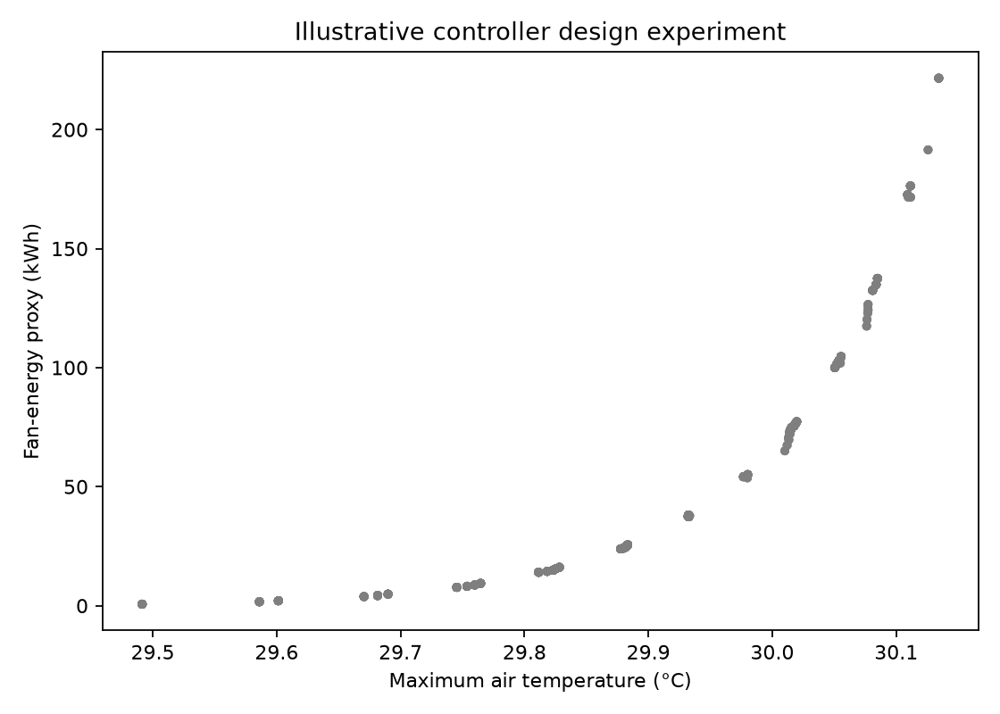

# Optimization Experiment

V2 calculated all 1,800 admissible controller combinations. Demonstration
constraints were maximum air temperature ≤29 °C, maximum CO₂ ≤1200 ppm, and
maximum absolute pressure difference ≤100 Pa.

No combination met all three. The minimum calculated maximum temperature was
29.491 °C (base 10 m³/s, maximum 50 m³/s, zero gains), while the synthetic
outdoor condition was 30 °C. The CO₂ and pressure constraints were satisfied,
but the temperature target was not.

This is a useful infeasibility result for the chosen model and experiment. The
thresholds are not regulatory limits, and the grid is not engineering
optimization.

